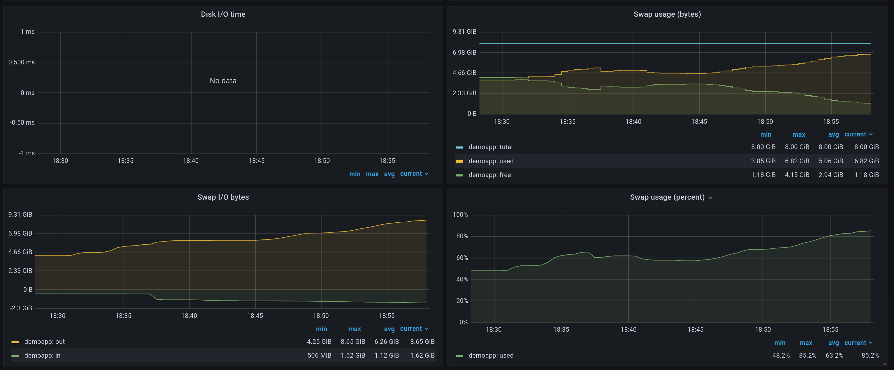
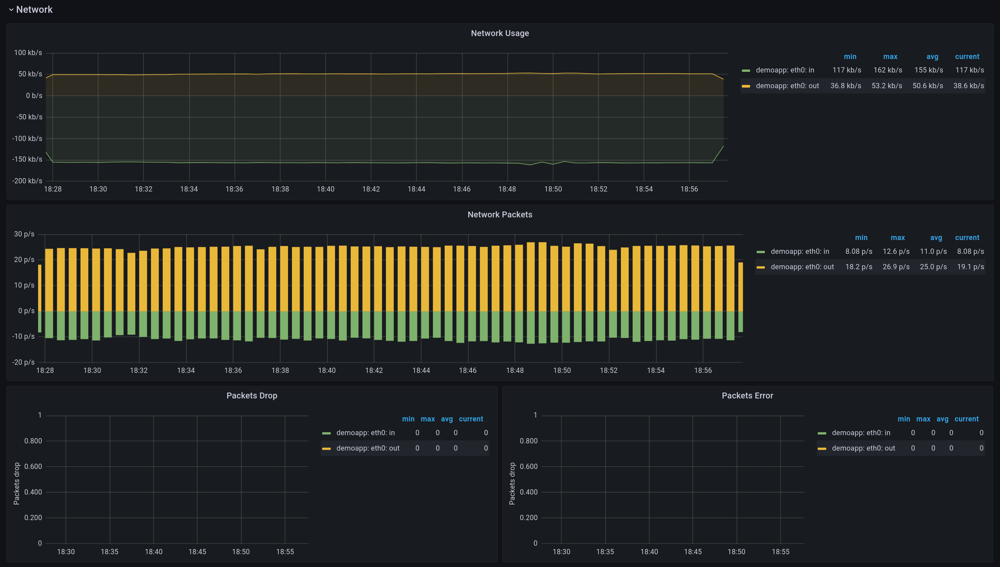
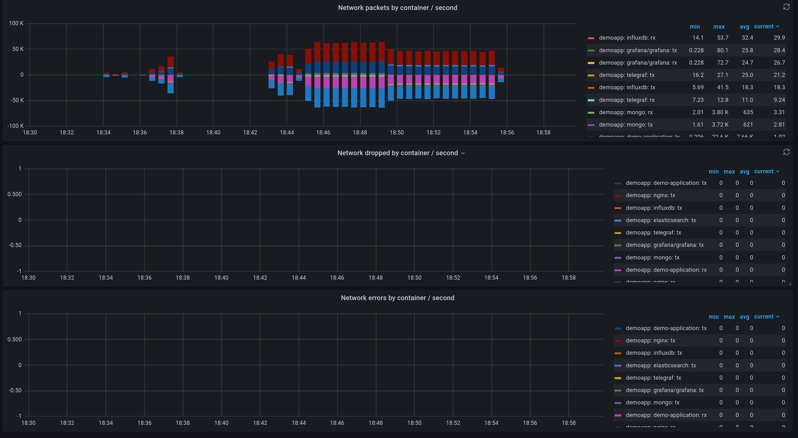

# Resource monitoring system using TIG stack

This repository provides an example of setting up a monitoring system for a simple architecture, including:

- Spring Boot app
- MongoDB 
- Elasticsearch 
- nginx 

The monitoring stack is implemented using the TIG Stack (Telegraf, InfluxDB, and Grafana).

## Quick Start

To start the monitoring stack, run the following command:
```
docker-compose up
```

##  Experiments and results

The system load was generated using ApacheBench with commands from [script](load_test.sh).

### Summary dashboard


### System




### Network



### Docker




### nginx


### MongoDB


### Elasticsearch


